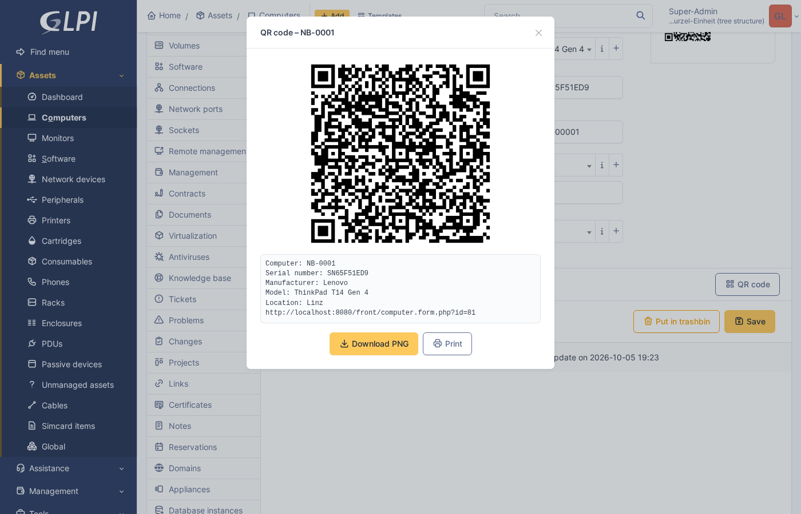

# Asset QR Codes for GLPI

GLPI 11 plugin that adds a QR code button to every asset. The encoded text is built from a
configurable template of asset fields.

## Feature: QR codes for assets



Every asset form (computers, monitors, printers, … including custom asset types) gets a **QR code** button below the form.
It opens a dialog with the QR code, the encoded text, and "Download PNG" / "Print" actions.

The encoded text is a template configured under *Setup → Plugins → Asset QR Codes* (gear icon), globally and optionally per asset type:

```
{itemtype}: {name}
Serial number: {serial}
Manufacturer: {manufacturers_id}
{url}
```

- `{column}`: any column of the asset; foreign keys (`*_id`) are resolved to their names
- `{id}`, `{itemtype}`, `{url}`, `{entity}`: extra values
- Lines that are empty after substitution are dropped

## Translations
Languages: German (`de_DE`), English (`en_GB`), Spanish (`es_ES`), French (`fr_FR`), Italian (`it_IT`).
Source strings are English and always use the plugin domain: `__('Text', 'assetqr')`.

```bash
tools/locales.sh           # extract strings to locales/assetqr.pot, update all .po files, compile .mo
tools/locales.sh compile   # only compile .po -> .mo
```

New or changed strings end up empty (or `fuzzy`) in the `.po` files: translate them, then run the script again.
To add a language, add its code to `LANGS` in `tools/locales.sh`. GLPI picks `locales/<user language>.mo`,
falls back to the system language and then to `en_GB`; regional variants (e.g. `de_AT`, `fr_CA`) need their own file.

## Development environment
1. Open the folder in VS Code → "Reopen in Container".
2. After the first start: http://localhost:8080 (login `glpi` / `glpi`).
3. The plugin lives at `/var/www/glpi/plugins/assetqr` and is installed and activated automatically.

## Sample data
```bash
sudo -u www-data php .devcontainer/seed.php          # 50 computers (idempotent)
sudo -u www-data php .devcontainer/seed.php 200      # different number
sudo -u www-data php .devcontainer/seed.php --purge  # delete all computers first
```
To seed automatically when the container is created, set `GLPI_SEED_DATA=1` in `docker-compose.yml`.

## Useful commands
```bash
sudo -u www-data php /var/www/glpi/bin/console plugin:list
sudo -u www-data php /var/www/glpi/bin/console cache:clear
tail -f /var/log/glpi/php-errors.log
```

## Debugging
Xdebug only starts on trigger: use the "Xdebug Helper" browser extension
or append `?XDEBUG_TRIGGER=1` to the URL, then start "Xdebug: Listen" in VS Code.

## Development checks
```bash
composer install     # dev tools (php-cs-fixer)
composer lint        # PHP syntax check
composer cs          # coding standard (PER-CS 2.0, as GLPI); composer cs-fix to fix
```
The same checks run on GitHub for every push and pull request (`.github/workflows/ci.yml`).

## Release
1. Bump `PLUGIN_ASSETQR_VERSION` in `setup.php` and add the version to `assetqr.xml`
   (`<num>`, `<compatibility>`, `<download_url>`).
2. Commit, then tag and push: `git tag v0.1.0 && git push origin main v0.1.0`
3. The GitHub workflow `.github/workflows/release.yml` builds `assetqr-<version>.tar.bz2`
   with `tools/release.sh` and attaches it to the GitHub release.

The archive contains a single `assetqr/` directory; files marked `export-ignore` in
`.gitattributes` (devcontainer, tools, CI) are excluded. Build locally with `tools/release.sh`.

The plugins catalog reads `assetqr.xml` from
`https://raw.githubusercontent.com/mbrigl/glpi-assetqr/main/assetqr.xml`.

## Renaming the plugin
The plugin name (lowercase letters/digits only) must be identical everywhere:
- `docker-compose.yml`: mount target `/var/www/glpi/plugins/<name>`
- `devcontainer.json`: `workspaceFolder`
- `setup.php` / `hook.php`: function names `plugin_<name>_...` and constants

## Starting from scratch
Delete the volumes (`glpi-data`, `db-data`) and rebuild the container.
